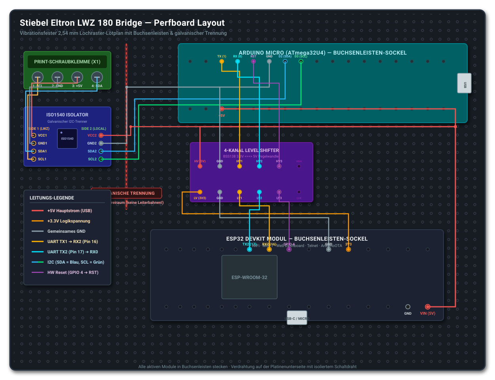

# LWZ 180 Home Assistant Bridge — Lochraster-Lötplan & Aufbauanleitung

Dieses Dokument beschreibt den professionellen, vibrationsfesten Aufbau der Stiebel Eltron LWZ 180 Bridge auf einer standardisierten 2,54 mm Lochrasterplatine (Punktraster oder Streifenraster, z. B. 70 × 90 mm oder 80 × 120 mm).

---

## 1. Materialliste (Stückliste)

| Pos | Bauteil | Typ / Spezifikation | Zweck |
| :--- | :--- | :--- | :--- |
| **1** | Lochrasterplatine | FR4, Punktraster 2,54 mm (z. B. 70×90 mm) | Trägerplatine |
| **2** | Schraubklemme (Print) | 4-polig, Rastermaß 5,08 mm oder 3,81 mm | Robuster Anschluss der 4 Adern zur LWZ 180 |
| **3** | Buchsenleisten (Female) | 2,54 mm Pitch (Standard-Höhe 8,5 mm) | Zum Stecken (nicht Einlöten!) aller Module |
| | - Für ESP32 | 2× 15-polig (bei 30-Pin) bzw. 2× 19-polig (bei 38-Pin) | ESP32-Sockel |
| | - Für Arduino Micro | 2× 17-polig | Arduino-Sockel |
| | - Für ISO1540 Breakout | 2× 4-polig oder 2× 5-polig (je nach Board) | Isolator-Sockel |
| | - Für 4-Kanal Level Shifter | 2× 6-polig | Pegelwandler-Sockel |
| **4** | Schaltdraht | Massivdraht 0,5 mm² oder isolierter AWG24/AWG26 Draht | Verdrahtung auf der Unterseite |
| **5** | *(Optional)* Kondensator | 1× 100 µF / 16V Elko + 1× 100 nF Keramik | Stützkondensator an 5V / GND zur Pufferung |

> **Goldene Regel: Nichts festlöten!**
> Alle vier aktiven Module (ESP32, Arduino Micro, ISO1540, Level Shifter) werden **ausschließlich in Buchsenleisten gesteckt**. Sollte jemals ein Bauteil defekt sein oder du möchtest ein Board am PC umflashen, ziehst du es einfach schadlos aus dem Sockel.

### 1.1 Amazon-Einkaufsliste mit exakten Suchbegriffen

| Komponente | Exakter Amazon-Suchbegriff | Empfohlene Spezifikation & Tipps | ca. Preis |
| :--- | :--- | :--- | :--- |
| **Lochrasterplatinen** | `Lochrasterplatine 2.54mm FR4 Set` | Wichtig: **FR-4** Glasfaser (kein billiges Pertinax/Pappe), doppelseitig durchkontaktiert. Platinengröße ideal: **7 × 9 cm** (oder gemischtes 10er-Set). | ~7 – 9 € (Set) |
| **Buchsenleisten** | `Buchsenleiste 2.54mm einreihig Set` | 2,54 mm Rastermaß, einreihig (Single Row). Am praktischsten ist ein Set aus trennbaren 40-poligen Leisten, die du mit dem Seitenschneider auf 15, 17, 6 und 4 Pins kürzt. | ~6 – 8 € (Set) |
| **Print-Schraubklemmen** | `Printklemme 5.08mm KF301` *(oder `Schraubklemme 5.08mm 4 pin`)* | 5,08 mm Rastermaß für Leiterplatten. Entweder als fertige 4-Pin-Klemme oder als anreihbare 2-Pin-Klemmen (2 Stück aneinandergesteckt). | ~5 – 7 € (Pack) |
| **Schaltdraht** | `Schaltdraht Set AWG24 massiv` | **Massiver** Kupferdraht (*Solid Core*, nicht flexible Litze!). AWG 24 (ca. 0,5 mm²) lässt sich sauber biegen und bleibt beim Löten exakt in Position. Ideal als Set mit verschiedenen Farben (Rot, Schwarz, etc.). | ~8 – 12 € (Set) |
| **Abstandshalter** | `M3 Abstandshalter Nylon Set` | M3 Kunststoff-Distanzbolzen (z. B. 10 mm Höhe mit M3 Schrauben & Muttern) für die 4 Ecken, damit die Lötstellen auf der Unterseite isoliert bleiben. | ~6 – 9 € (Set) |
| *(Falls Lötzinn fehlt)* | `Elektronik Lötzinn 0.8mm` | Dünnes Lötzinn (0,8 mm oder 1,0 mm) mit integrierter Flussmittelseele (Rosin Core / Kolophonium). | ~7 – 10 € |

---

## 2. Sicherheitszone: Die galvanische Trennung (Barrier)

Die Stiebel Eltron LWZ 180 führt auf Klemme 1–8 eigene Busspannungen. Um die Heizungselektronik vor Potenzialunterschieden, Erdschleifen und Blitzschlag zu schützen, muss die **galvanische Trennung** auf der Platine physikalisch eingehalten werden:

```
[ STIEBEL ELTRON SEITE ]             | [ LOKALE SEITE (ESP32 & ARDUINO) ]
(Klemme 1, 3, 5, 7 der LWZ)          | (GND & 5V vom USB-Netzteil)
                                     |
    4-Pol Schraubklemme              |   Arduino Micro
           |                         |   Level Shifter
           v                         |   ESP32
    ISO1540 (Seite 1: V1, G1, D1, C1)|==>ISO1540 (Seite 2: V2, G2, D2, C2)
                                     |
               ISOLATIONS-GRABEN (min. 4-5 mm Abstand)
               Hier dürfen KEINE lokalen Leiterbahnen laufen!
```

* **Seite 1 des ISO1540** und die 4-polige Schraubklemme gehören in eine eigene Ecke der Platine.
* Zwischen der Schraubklemme / ISO1540-Seite 1 und dem Rest der Schaltung lässt du mindestens **2–3 leere Lochreihen frei** (kein lokales GND oder 5V dorthin führen).

---

## 3. Topologischer Layout-Plan (Draufsicht Platine)



Ein bewährtes, aufgeräumtes Layout auf einer Platine mit ca. 28 × 36 Löchern:

```
+--------------------------------------------------------------------------+
|  [SCHRAUBKLEMME 4-POL]                                                   |
|  [1:SCL] [2:GND] [3:5V] [4:SDA]                                          |
|      |       |      |      |                                             |
|      v       v      v      v                                             |
|  +---------------------------+       +--------------------------------+  |
|  |     ISO1540 BREAKOUT      |       |         ARDUINO MICRO          |  |
|  | [VCC1]             [VCC2] |-----> | 5V                         VIN |  |
|  | [GND1]             [GND2] |-----> | GND                        MISO|  |
|  | [SDA1]             [SDA2] |-----> | D2 (SDA)                   SCK |  |
|  | [SCL1]             [SCL2] |-----> | D3 (SCL)                   +5V |  |
|  +---------------------------+       | D0 (RX) <---[HV2]          ... |  |
|  =============================       | D1 (TX) --->[HV1]          ... |  |
|  || ISOLATIONS-SPERRE (LEER)||       | RESET   <---[HV3] (opt)    ... |  |
|  =============================       +--------------------------------+  |
|                                                      |                   |
|                      +-----------------------+       |                   |
|                      | 4-KANAL LEVEL SHIFTER | <-----+                   |
|                      |  [HIGH]       [LOW]   |                           |
|                      |   HV  <=======> LV    | <----+                    |
|                      |   GND <=======> GND   | <----+                    |
|                      |   HV1 <=======> LV1   | ---->| ESP32 RX2 (Pin 16) |
|                      |   HV2 <=======> LV2   | <----| ESP32 TX2 (Pin 17) |
|                      |   HV3 <=======> LV3   | <----| ESP32 GPIO 4 (opt) |
|                      +-----------------------+      +--------------------+
|                                                                          |
|  +--------------------------------------------------------------------+  |
|  |                        ESP32 DEVKIT MODUL                          |  |
|  |  [3V3]   [GND]   [GPIO16/RX2]   [GPIO17/TX2]   [GPIO4]   [VIN/5V]  |  |
|  |                                                                    |  |
|  |                           [ MICRO-USB / USB-C ]                    |  |
|  +--------------------------------------------------------------------+  |
+--------------------------------------------------------------------------+
```

---

## 4. Vollständige Pin-zu-Pin Verbindungsliste (Löt-Checkliste)

Hake diese Verbindungen beim Löten auf der Unterseite Schritt für Schritt ab:

### Gruppe A: Stiebel Eltron Bus & Galvanische Trennung (Seite 1)
* [ ] **Schraubklemme Pin 1 (SCL)** ➔ ISO1540 **`SCL1`**
* [ ] **Schraubklemme Pin 2 (GND)** ➔ ISO1540 **`GND1`**
* [ ] **Schraubklemme Pin 3 (+5V)** ➔ ISO1540 **`VCC1`**
* [ ] **Schraubklemme Pin 4 (SDA)** ➔ ISO1540 **`SDA1`**

### Gruppe B: Lokale Stromversorgung (5V & 3.3V Schienen)
*Die gesamte Schaltung wird über das USB-Kabel des ESP32 mit Strom versorgt!*
* [ ] **ESP32 Pin `VIN` (oder `5V`)** ➔ **5V-Hauptschiene**:
  * [ ] ➔ Arduino Micro Pin **`5V`** *(oder Pin `RAW`/`VIN`)*
  * [ ] ➔ ISO1540 Pin **`VCC2`** (Seite 2)
  * [ ] ➔ Level Shifter Pin **`HV`** (High Voltage Power)
* [ ] **ESP32 Pin `3V3`** ➔ **3.3V-Schiene**:
  * [ ] ➔ Level Shifter Pin **`LV`** (Low Voltage Power)

### Gruppe C: Lokale Masse (Gemeinsamer Ground)
*Alle lokalen Komponenten müssen denselben Bezugspunkt haben:*
* [ ] **ESP32 Pin `GND`** ➔ **GND-Hauptschiene**:
  * [ ] ➔ Arduino Micro Pin **`GND`**
  * [ ] ➔ ISO1540 Pin **`GND2`** (Seite 2)
  * [ ] ➔ Level Shifter Pin **`GND`** (sowohl auf der HV- als auch auf der LV-Seite)

### Gruppe D: I2C-Busverbindung (Arduino Micro ➔ ISO1540 Seite 2)
* [ ] ISO1540 Pin **`SDA2`** ➔ Arduino Micro Pin **`2` (D2 / SDA)**
* [ ] ISO1540 Pin **`SCL2`** ➔ Arduino Micro Pin **`3` (D3 / SCL)**

### Gruppe E: UART-Datenverbindung (Über Level Shifter)
* **Kanal 1 (Arduino TX ➔ ESP32 RX2):**
  * [ ] Arduino Micro Pin **`1` (TX / D1)** ➔ Level Shifter **`HV1`**
  * [ ] Level Shifter **`LV1`** ➔ ESP32 Pin **`16` (RX2)**
* **Kanal 2 (ESP32 TX2 ➔ Arduino RX):**
  * [ ] ESP32 Pin **`17` (TX2)** ➔ Level Shifter **`LV2`**
  * [ ] Level Shifter **`HV2`** ➔ Arduino Micro Pin **`0` (RX / D0)**

### Gruppe F: Hardware-Reset Leitung *(Neu / Optional, aber sehr empfohlen)*
*Ermöglicht es dem ESP32, den Arduino Micro per Weboberfläche hard zu resetten:*
* [ ] ESP32 Pin **`GPIO 4`** ➔ Level Shifter **`LV3`**
* [ ] Level Shifter **`HV3`** ➔ Arduino Micro Pin **`RESET`**

---

## 5. Vorbereitung vor dem ersten Einschalten (Der 2-Minuten Kalt-Test)

Bevor du die Module in die Buchsenleisten steckst:

1. **Sichtprüfung**: Prüfe die Unterseite auf ungewollte Lötzinn-Brücken zwischen benachbarten Pins.
2. **Durchgangsprüfung mit Multimeter (Ohmmeter/Piepser)**:
   * Prüfe, dass zwischen **5V-Schiene** und **GND-Schiene** **KEIN Kurzschluss** besteht (Widerstand > 10 kΩ).
   * Prüfe, dass **GND1** (Stiebel Seite) und **GND2** (Lokale Seite) **vollständig voneinander isoliert** sind (Multimeter darf NICHT piepsen).
3. **Spannungstest (nur ESP32 eingesteckt)**:
   * Stecke **nur den ESP32** in seinen Sockel und schließe das USB-Kabel an.
   * Miss mit dem Multimeter an den leeren Sockeln nach:
     * Am Arduino-Sockel: Liegen an Pin `5V` und `GND` ca. 4,8 – 5,1 V an?
     * Am ISO1540-Sockel: Liegen an `VCC2` und `GND2` ca. 5 V an?
     * Am Level-Shifter: Liegen an `HV` ca. 5 V und an `LV` ca. 3,3 V an?
4. **Fertigstellen**:
   * USB-Kabel abziehen.
   * Alle Module (Arduino Micro, ISO1540, Level Shifter) in ihre Sockel drücken.
   * Platine an die LWZ 180 anschließen (Klemmen 1, 3, 5, 7) und USB-Stromversorgung anstecken.

---

## 6. Anschluss an der LWZ 180 (Klemmenleiste X1)

| Klemme LWZ 180 | Signal | Ader / Schraubklemme Platine |
| :--- | :--- | :--- |
| **Klemme 1** | SCL | Schraubklemme Pin 1 |
| **Klemme 3** | GND | Schraubklemme Pin 2 |
| **Klemme 5** | +5V | Schraubklemme Pin 3 |
| **Klemme 7** | SDA | Schraubklemme Pin 4 |

*(Hinweis: Bei manchen Baureihen ist die Belegung alternativ 2=SCL, 4=GND, 6=+5V, 8=SDA).*
